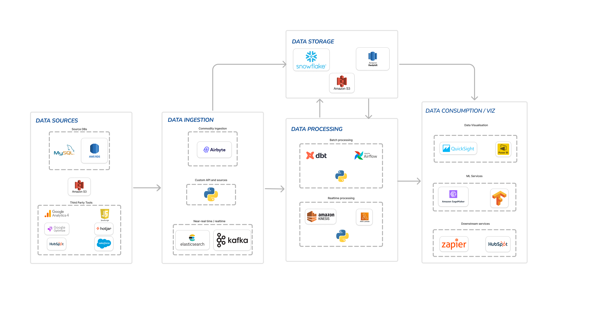
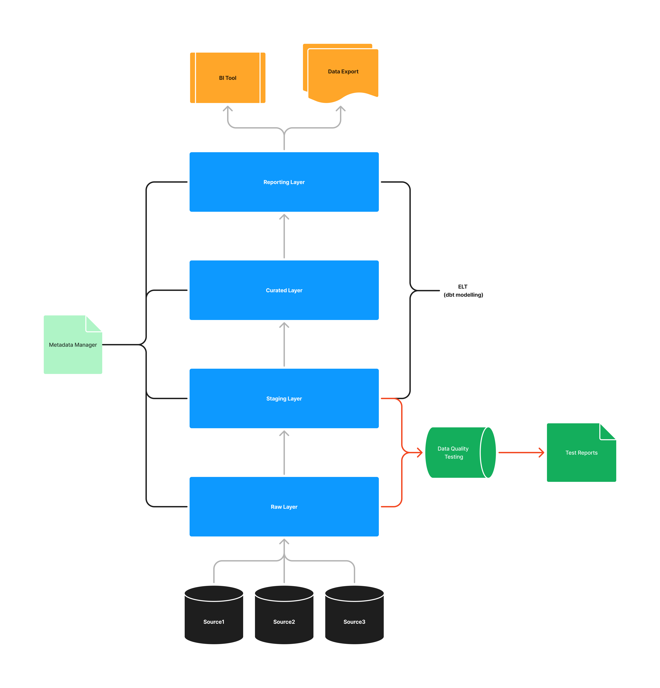

# **Task 1: Designing a**  **robust data ecosystem**

# Approach to the Challenge

To address the challenge of designing a robust data ecosystem, I will break down the components of the architecture, explain the technologies used, and outline how to implement and manage this infrastructure. I'll also discuss the rationale behind technology choices and alternatives, event consumption and publishing, job scheduling, and how these solutions enable comprehensive customer insights using BI tools.

### **Architecture Overview**

The architecture consists of the following main components:

1. **Data Sources**: Collect data from various sources including backend databases and storage systems used in the organization such as MySQL, AWS RDS, Amazon S3, and third-party tools like Google Analytics, Hotjar, HubSpot, and Salesforce.  
2. **Data Ingestion**: Manage data ingestion using tools like Airbyte for commodity ingestion, custom API sources using Python for programmatic data ingestion, Elasticsearch, and Kafka for near-real-time data ingestion.  
3. **Data Storage**: Centralize the data storage in a cloud-based data warehouse such as  Snowflake or Amazon Redshift, and Amazon S3 as object storage system.  
4. **Data Processing**: Process and transform data using batch processing tools like dbt for data modeling and Apache Airflow for orchestration, and real-time processing tools like Amazon Kinesis and AWS Lambda.  
5. **Data Visualization**: Enable data visualization using BI Tools like QuickSight and Power BI. Enable ML services using Amazon SageMaker and Tensorflow.  
6. **Data Consumption**:  Integrate processed data with downstream services like scheduled reporting and third party tools like Zapier and HubSpot using reverse ETL tools or custom APIs.

# Detailed Explanation 

#### **1\. Data Ingestion**

* **Technologies**: Airbyte, Python, Elasticsearch, Kafka.  
* **Rationale**:
  * **Airbyte**: An open-source data integration tool that easily connects to various data sources and handles ETL processes that is already part of the Superside Tech stack.  
  * **Python**: For custom API and source ingestion due to its flexibility and extensive libraries.  
  * **Elasticsearch & Kafka**: For near-real-time data ingestion, offering robust real-time processing and search capabilities.  
* **Alternatives**:  
  * **Fivetran** for managed ETL,  
  * **Logstash** for real-time data ingestion,  
  * **Apache Flink** for real-time data processing.

#### **2\. Data Storage**

* **Technologies**: Snowflake as part of the Superside techstack, Amazon Redshift, Amazon S3.  
* **Rationale**:  
  * **Snowflake**: Offers scalable and flexible cloud data warehousing.  
  * **Amazon Redshift**: Provides a powerful, managed data warehouse service hosted in AWS.  
  * **Amazon S3**: Used for object storage and staging area for raw as well as processed data. It can be used to easily transfer data between different systems.  
* **Alternatives**:  
  * **Google BigQuery** for data warehousing,  
  * **Azure Data Lake Storage** for scalable data lakes.

#### **3\. Data Processing**

* **Technologies**: dbt, Apache Airflow, Python, Amazon Kinesis, AWS Lambda.  
* **Rationale**:  
  * **dbt**: For transformation of data within the warehouse.  
  * **Apache Airflow**: For scheduling and managing ETL workflows.  
  * **Python**: For custom processing scripts.  
  * **Amazon Kinesis & AWS Lambda**: For real-time data processing.  
* **Alternatives**:  
  * **Prefect or Dagster** as an alternative to Airflow,  
  * **Apache Beam** for stream processing.

#### **4\. Data Visualization**

* **Technologies**: QuickSight, Power BI.  
* **Rationale**:  
  * **QuickSight & Power BI**: For powerful data visualization and reporting.  
* **Alternatives**:  
  * **Tableau or Looker** for data visualization,  
  * **Google Data Studio** for lightweight BI.

#### **5\. Data Consumption**

* **Technologies**: Zapier, custom APIs  
* **Rationale**:  
  * **Zapier**: For integrating processed data back into business tools and workflows which has readily available connectors for multiple systems,  
  * **Custom APIs**: For programmatically exporting data to third-party tools and data consumers,  
  * **Amazon SageMaker & TensorFlow**: For machine learning and predictive analytics.  
* **Alternatives**:  
  * **Segment** for reverse ETL,  
  * **Azure ML** for machine learning.

# Tech Infrastructure Proposal

#### **Infrastructure Components:**

* **Compute**: AWS EC2 for hosting Airflow, custom ingestion scripts, and other processing tasks.  
* **Storage**: Snowflake, Amazon Redshift, Amazon S3.  
* **Networking**: VPCs, subnets, security groups, and load balancers to ensure secure and efficient data transfer.  
* **Monitoring & Logging**: AWS CloudWatch, ELK Stack (Elasticsearch, Logstash, Kibana) for monitoring and logging.

# Implementation and Management

#### **Steps:**

1. **Set Up Data Sources**: Configure access to all source databases and third-party tools.  
2. **Implement Data Ingestion Pipelines**:  
   * Use Airbyte for commodity data ingestion.  
   * Develop Python scripts for custom APIs.  
   * Set up Elasticsearch and Kafka for real-time data streams.  
3. **Configure Data Storage**:  
   * Set up Snowflake/Redshift instances.  
   * Create S3 buckets for staging raw data.  
4. **Develop Data Processing Pipelines**:  
   * Create dbt models for data transformation.  
   * Schedule ETL jobs using Apache Airflow.  
   * Implement real-time processing with Kinesis and Lambda.  
5. **Enable Data Consumption and Visualization**:  
   * Configure QuickSight/Power BI for dashboards.  
   * Set up SageMaker and TensorFlow for ML models.  
   * Integrate reverse ETL for downstream services.

# Collaboration with DevOps

* **Provisioning Infrastructure**: Work with DevOps to provision AWS resources using Infrastructure as Code (IaC) tools like Terraform or AWS CloudFormation.  
* **CI/CD Pipelines**: Establish CI/CD pipelines for deploying ingestion and processing scripts.  
* **Monitoring and Alerts**: Set up monitoring and alerting mechanisms to ensure system reliability and performance.  
* **Security**: Ensure data encryption, IAM roles, and policies are in place to secure data.

# Integration of Events Consumption and Publishing

* **Event-Driven Architecture**: Use Amazon SNS/SQS for event publishing and subscribing.  
* **Integration with Kafka**: For handling high-throughput event streams.

# Job Scheduler in the Ecosystem

* **Apache Airflow**: As the primary job scheduler to manage and orchestrate data pipelines.  
* **AWS Step Functions**: For orchestrating complex workflows involving multiple AWS services.

# Enabling Comprehensive Customer Insights

* **Unified Data View**: Centralizing data in Snowflake/Redshift allows for comprehensive analytics.  
* **BI Tools**: Use QuickSight and Power BI for interactive dashboards and reports.  
* **ML Integration**: Leverage SageMaker and TensorFlow for predictive analytics, feeding insights back into business processes.

This comprehensive approach ensures a robust, scalable, and efficient data ecosystem that supports advanced analytics and business intelligence.

# **Task 2: Data warehousing**

# Data Warehouse Overview

The conceptual model for the data warehouse, as illustrated in the diagram, consists of several layers and components designed to handle data from various sources, ensure data quality, provide data governance and facilitate analysis and reporting. The primary components include:

1. **Raw Layer**: To host the raw data ingested from various data sources.  
2. **Staging Layer**: Storage for data preprocessing with some light transformations on the raw data.  
3. **Curated Layer**: Store processed and cleaned data.  
4. **Reporting Layer**: To hold data that is ready for analysis and reporting.  
5. **Data Quality Testing**: Ensures data integrity and accuracy.  
6. **Metadata Manager**: Manages metadata across layers and useful for data governance.

#  Detailed Explanation

1. **Raw Layer**  
 * **Function**: Hosts raw data collected from various sources, without applying any transformations.  
 * **Rationale**: Keeps a copy of the original data for traceability, data testing and auditing purposes.  
    
2. **Staging Layer**  
 * **Function**: Acts as a storage area for data preprocessing and transformations. 
 * **Rationale**: Allows for data cleaning and initial transformation without affecting the raw data. Can be used to apply data anonymization and masking for data security purposes to hide PII and confidential data from unnecessary downstream data consumers.  
    
3. **Curated Layer**  
 * **Function**: Stores cleaned and processed data joining various tables and datasets, compiling everything together and making ready for analysis.  
 * **Rationale**: Provides a refined dataset for downstream processing and analytics.  
    
4. **Reporting Layer**  
 * **Function**: Stores data optimized for reporting and analysis.  
 * **Rationale**: Ensures that data is in the most efficient format for BI tools and reporting purposes.  
    
5. **Data Quality Testing**  
 * **Function**: Validates data accuracy and integrity before it moves to the next layer.  
 * **Rationale**: Critical for maintaining high data quality, which is essential for reliable analytics and building consumers’ trust on available data.  
 * **Technology**:   
  		* **dbt test**: for testing and validating data, due to its integration with modern data warehouses and its ability to automate data quality checks.  
  		* **Elementary data**: a dbt-native tool for data observability that allows integration of a wide range of in-built and custom data quality tests.

6. **Data Governance**  
 * **Function**: Manages metadata for all layers, providing context and structure to the data.  
 * **Rationale**: Ensures consistent data definitions, schema validations and documentation across the data pipeline. Provides detailed analysis on data observability and real-time monitoring and notifications for data quality failures.  
 * **Technology**:   
  		* **dbt docs**: Provides comprehensive definitions and lineage of data assets.  
  		* **Elementary data**: Provides analytics on data quality metrics and notifications for dbt model and test failures.

## **Proposed Data Warehouse: Snowflake**

### Justification

1. **Scalability**: Snowflake's architecture allows for independent scaling of compute and storage, making it highly scalable and cost-effective.  
2. **Performance**: Offers high performance for both batch and real-time data processing with features like automatic clustering and materialized views.  
3. **Integration**: Seamless integration with various data sources, ingestion tools, and BI platforms.  
4. **Security**: Comprehensive security features, including data encryption, access controls, and compliance certifications.  
5. **Ease of Use**: Simplifies data management with features like zero-copy cloning and time travel, enhancing productivity for data engineers and analysts.

### Implementation Plan

* **Data Ingestion:**   
  - Use Airbyte or custom Python scripts to load data into the Raw Layer.   
  - Schedule batch jobs using Apache Airflow for periodic data loads.  
  - Implement real-time data ingestion with Amazon Kinesis for streaming data.

* **Data Processing:**  
  - Move raw data to the Staging Layer (Snowflake) for preprocessing.  
  - Use dbt for data transformations and quality checks.  
  - Load cleaned data into the Curated Layer.  
  - Process data in the Curated Layer and make it ready for reporting and analysis in the Reporting Layer.

* **Data Storage:**  
  - Store processed data in Snowflake for efficient querying and analysis.  
  - Implement data partitioning and clustering for performance optimization.

* **Data Quality:**  
  - Implement automated data quality tests using dbt and Elementary.  
  - Generate test reports and log any data quality issues for remediation.

* **Data Consumption:**  
  - Configure BI Tools to connect to the Reporting Layer.  
  - Set up data export pipelines using custom APIs or reverse ETL tools for downstream systems.

* **Monitoring and Maintenance:**  
  - Use AWS CloudWatch and ELK Stack for monitoring and logging.  
  - Use Elementary data to monitor and log issues with dbt models and tests.  
  - Implement regular maintenance tasks like vacuuming and data archiving to ensure optimal performance.

This conceptual model and implementation plan provide a robust framework for a data warehouse that ensures data accessibility, quality, and performance. By leveraging Snowflake's advanced features and integrating with various data sources and tools, this solution supports comprehensive data analysis and decision-making processes.

# **Task 3: API Integration**

## 1\. Approach to API Integration

**Step 1: Requirements Gathering and Analysis**

* **Understand System Requirements**: Determine the exact data and functionality required from the Crunchbase API. This might include data related to specific companies, their financials, key personnel, etc.  
* **API Documentation Review**: Thoroughly review the Crunchbase API documentation to understand the endpoints, authentication methods, rate limits, pagination, data structure, and any other specific details.  
* **Define Integration Points**: Identify where and how the API will be integrated into the existing system (e.g. data ingestion pipeline, user-facing dashboards, etc.).

**Step 2: API Key Management**

* **API Key Procurement:** Explore how to generate and use API keys for authentication, their validity period and any other specific details.  
* **Secure Storage**: Store API keys securely, for instance, using environment variables or configuration files with restricted access like a `secrets.txt` file.  
* **Parameterization**: Ensure that URLs, API keys, and other configurations are parameterized to allow flexibility and scalability.

**Step 3: Development of API Integration**

* **Build Modular Components**: Develop modular Python functions or classes to handle different aspects of the API interaction, such as making requests, parsing responses, and error handling.  
* **Data Mapping**: Map the JSON response fields from Crunchbase to the system’s data model. This involves creating a schema that aligns with the database or application's structure (not essential in our use case as data is only loaded to a Parquet file).

**Step 4: Testing and Validation**
* **Unit Testing**: Write unit tests to validate the API integration functions, ensuring they handle different scenarios like successful responses, errors, and edge cases.
* **Integration Testing**: Test the end-to-end flow of data retrieval, transformation, and loading to ensure the system behaves as expected.
* **Data Validation**: Validate the data integrity and consistency by comparing the fetched data with the expected results.

**Step 5: Deployment and Monitoring**
* **Containerization**: Package the API integration code into containers (e.g., Docker) for easy deployment and scalability.

## 2\. Anticipated Challenges and Solutions

**Challenge 1: API Rate Limits**

* **Problem**: Crunchbase API has rate limits that could impact how much data can be fetched in a given timeframe.  
* **Solution**: Implement a rate-limiting strategy using tools like `time.sleep()` to delay requests, or use a job queue to process API requests in batches. Also, consider caching data locally where possible to reduce redundant API calls.

**Challenge 2: Handling API Downtime or Changes**

* **Problem**: The Crunchbase API could experience downtime or unexpected changes in the response structure.  
* **Solution**: Implement robust error handling that retries requests on failure with exponential backoff. Also, subscribe to API status updates and documentation changes to adapt to any modifications promptly.

**Challenge 3: Data Consistency and Mapping**

* **Problem**: The JSON data returned by the API might not match exactly with the structure needed in the system, leading to potential data consistency issues.  
* **Solution**: Implement a data transformation layer that validates and cleans data before ingestion. Use data validation libraries to ensure the data conforms to the expected format.

**Challenge 4: Resource Management**

* **Problem**: Large chunks of data retrieved from the API and loaded to the destination might cause high resource consumption of the system.
* **Solution**: Use Python generators and yield function to batch process data in smaller chunks and incrementally load to the destination.

**Challenge 5: Security Concerns**

* **Problem**: Exposure of API keys or sensitive data during transmission.  
* **Solution**: Use secure storage mechanisms for API keys (like environment variables or secrets file) and ensure all data transmission is done over HTTPS. Implement logging and monitoring to detect any unauthorized access.

## 3\. Strategy for Monitoring, Tracking, and Handling Errors

**Monitoring and Tracking**

* **Logging**: Implement detailed logging for every API request and response. This includes logging the request URL, parameters, response status code, and any errors. Use logging libraries like `logging` in Python with different levels (INFO, DEBUG, ERROR).  
* **APM Tools**: Utilize Application Performance Management (APM) tools like Datadog, New Relic, or Prometheus to monitor the performance of API calls, including latency, failure rates, and throughput.  
* **Alerts**: Set up alerts for specific conditions like repeated API failures, high latency, or nearing rate limits. These can be configured through your APM tools or custom scripts.

**Error Handling**

* **Retry Mechanism**: Implement a retry mechanism for transient errors like timeouts or temporary network issues. Use exponential backoff to avoid overwhelming the API.  
* **Graceful Degradation**: If the API is temporarily unavailable, ensure the system can continue operating with reduced functionality. For instance, serve cached data or fallback data sources.  
* **Error Reporting**: Use tools like Sentry or Rollbar for real-time error tracking. These tools can capture stack traces and contextual information, helping in quicker diagnosis and resolution of issues.

**Continuous Improvement**

* **Feedback Loop**: Continuously monitor the performance and error logs, adjusting the error handling and retry logic as necessary. Regularly review and update the integration to handle any new edge cases or changes in the API.  
* **Documentation**: Maintain detailed internal documentation on how the API integration works, including the steps for troubleshooting common errors. This documentation should be updated regularly to reflect any changes in the API or the integration process.

This comprehensive approach ensures that the API integration is robust, resilient, and capable of handling both expected and unexpected challenges effectively.

# AI-Powered Tools Used
**GitHub Copilot** was used to assist in generating code snippets and providing suggestions for the API integration process. Copilot helped in writing boilerplate code, handling error scenarios, and suggesting best practices for Python programming. It significantly accelerated the development process and ensured code consistency and quality.

**ChatGPT** was used to generate the initial draft of the API integration strategy, including the approach, challenges, and solutions. ChatGPT provided a structured outline based on the input provided, which was then refined and expanded upon to create the final document. It helped in organizing the content and ensuring all key aspects were covered. 

It was also used to generate the detailed assignment documentations. It was provided the architecture diagram and key points to be described, and the content was generated based on the inputs.

Further, it was used for debugging when there were certain code issues. It helped in quickly identifying the root cause of the problem and provided suggestions for resolving the issues.